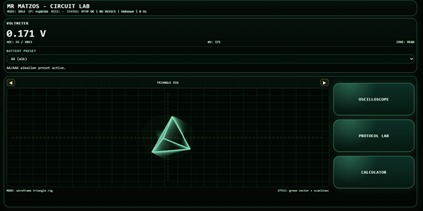
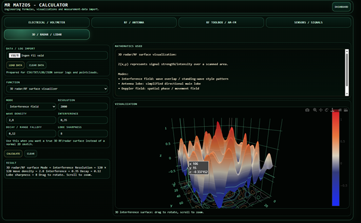
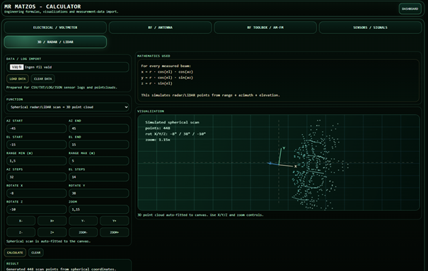

# MR MATZOS - CIRCUIT LAB

(C) 2026 Mats Schyllander  
Email: matsarlemark@gmail.com

ESP8266/ESP32-based engineering laboratory platform for real-time measurements, RF analysis, radar/lidar experimentation, protocol debugging and advanced electronics visualization.

---

# Overview

Mr Matzos Circuit Lab is a combined embedded systems + web engineering environment focused on:

- Real-time voltage and signal measurements
- UART protocol debugging
- RF and antenna calculations
- Radar / LiDAR visualization
- Doppler experimentation
- Sensor analysis
- WebSocket-based live dashboards
- Embedded + backend integration

---

# Features

## Embedded Firmware

- ESP8266 master/slave architecture
- UART-based ProtocolLab communication
- Real-time ADC voltage measurements
- PWM generation and monitoring
- WebSocket streaming
- OTA firmware updates
- Signal visualization
- Activity LED support
- Buzzer feedback effects

---

## Web Dashboard

- Live voltage meter
- Browser-based oscilloscope (WebScope)
- ProtocolLab UART terminal
- RF engineering toolbox
- Antenna calculations
- AM/FM engineering utilities
- Radar geometry tools
- Doppler calculations
- Signal analysis modules
- Interactive engineering visualizations
- 3D radar/lidar rendering
- Spherical radar scan visualization
- Dynamic RF surface plots
- Measurement data import system

---

## Backend

- Python FastAPI backend
- SQLite measurement storage
- REST API
- WebSocket communication
- Dockerized deployment
- Synology NAS support
- Nginx reverse proxy

---

# New Visualization System

The latest Circuit Lab update introduces a redesigned visualization engine focused on engineering relevance and cleaner workflow integration.

## Added

### 3D Radar / RF Surface Visualization

Interactive 3D rendering using:

- WebGL
- Plotly.js
- Dynamic RF surface generation
- Interference simulation
- Wave density control
- Radar lobe visualization
- Range decay simulation

### Spherical Radar / LiDAR Scan

- Spherical coordinate rendering
- Radar sweep simulation
- LiDAR-style scan display
- Engineering-oriented visualization modes

### RF Toolbox Expansion

- AM/FM engineering tools
- RF visualization modules
- Enhanced radar experimentation support

---

## Removed / Cleaned Up

Removed:

- Redundant 3D point cloud demo
- Unnecessary ADC-to-voltage demo module
- Duplicate radar visualization paths
- Unused debug visualization text
- Irrelevant always-on 3D rendering

The visualization engine is now context-aware and only activates advanced rendering when relevant.

---

# Hardware Requirements

## Main Hardware

### ESP8266 Master

Main controller responsible for:

- WiFi communication
- ADC measurements
- WebSocket streaming
- WebScope oscilloscope
- ProtocolLab server
- PWM generation

Recommended board:

- NodeMCU ESP8266

---

### ESP8266 Slave (Optional)

Optional secondary MCU used for:

- UART-controlled outputs
- Activity LED
- Buzzer effects
- Experimental peripherals

---

## Required Components

| Component | Purpose |
|---|---|
| ESP8266 Master MCU | Main controller |
| ESP8266 Slave MCU | UART peripheral controller |
| LED | Activity/status indication |
| Passive buzzer | Audio/debug feedback |
| Resistors | LED current limiting |
| Jumper wires | UART and signal connections |
| USB cable | Programming and power |

---

# UART Wiring

| Master | Slave |
|---|---|
| TX | RX |
| RX | TX |
| GND | GND |

---

# Project Structure

    Circuit_Lab/
    ├── backend/
    ├── firmware/
    │   ├── master/
    │   └── slave/
    ├── images/
    ├── nginx/
    ├── web/
    ├── docker-compose.yml
    └── README.md

---

# RF / Radar / LiDAR Modules

Circuit Lab includes experimental engineering utilities for:

- Antenna calculations
- RF propagation
- Radar geometry
- Doppler calculations
- Radar sweep simulation
- LiDAR visualization
- Spherical scan rendering
- Point cloud rendering
- Signal analysis
- Electrical calculations
- RF surface visualization

---

# Screenshots

## Dashboard



---

## Protocol Lab


---

## WebScope


---

## RF Calculator


---

## Antenna Visualizer


---

## 3D Radar / RF Visualization



---

## Spherical Radar / LiDAR Scan



---

# Deployment

The backend is designed to run on Synology NAS using Docker Compose and Nginx.

Start services:

```bash
docker compose up -d