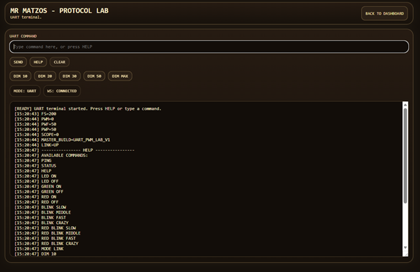
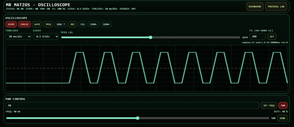
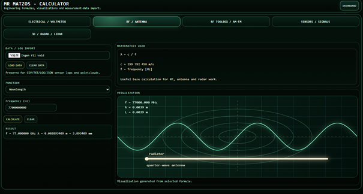
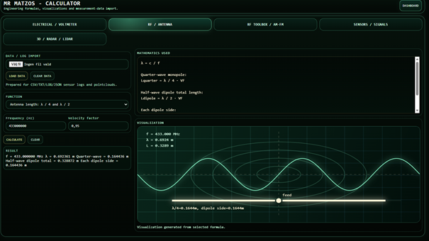
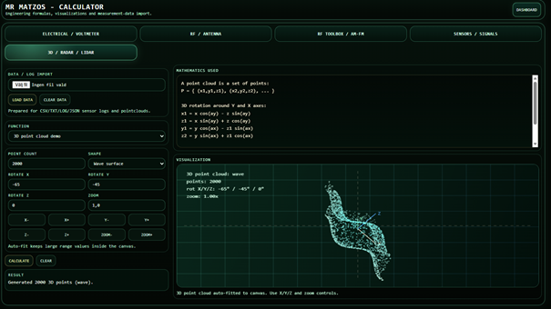

# Mr Matzos Circuit Lab

(C)2026 Mats Schyllander
Email: matsarlemark@gmail.com

ESP8266-based WiFi voltage meter, WebScope oscilloscope, ProtocolLab UART terminal, RF toolbox and electronics calculator platform.

A combined embedded systems + web engineering laboratory environment focused on real-time measurements, protocol testing, RF calculations, radar/lidar experimentation and electronics visualization.

---


---

# Features

## Embedded Firmware

* ESP8266 master/slave architecture
* UART-based ProtocolLab communication
* Real-time ADC voltage measurements
* PWM generation and monitoring
* WebSocket streaming
* OTA firmware updates
* Signal visualization
* Activity LED support
* Buzzer feedback effects

---

## Web Dashboard

* Live voltage meter
* Browser-based oscilloscope (WebScope)
* ProtocolLab UART terminal
* RF calculator modules
* Antenna calculations
* Radar geometry tools
* Doppler calculations
* Lidar point-cloud visualization
* Electrical engineering utilities
* Signal analysis modules

---

## Backend

* Python FastAPI backend
* SQLite measurement storage
* REST API
* WebSocket communication
* Dockerized deployment
* Synology NAS support
* Nginx reverse proxy

---

# Hardware Requirements

## Main Hardware

### ESP8266 Master

Main controller responsible for:

* WiFi communication
* ADC measurements
* WebSocket streaming
* WebScope oscilloscope
* ProtocolLab server
* PWM generation

Recommended boards:

* NodeMCU ESP8266
---

### ESP8266 Slave

Optional secondary MCU used for:

* UART-controlled outputs
* Activity LED
* Buzzer effects
* Experimental peripherals

---

# Required Components

| Component          | Purpose                     |
| ------------------ | --------------------------- |
| ESP8266 Master MCU | Main controller             |
| ESP8266 Slave MCU  | UART peripheral controller  |
| LED                | Activity/status indication  |
| Passive buzzer     | Audio/debug feedback        |
| Resistors          | LED current limiting        |
| Jumper wires       | UART and signal connections |
| USB cable          | Programming and power       |

---

# UART Wiring

Typical UART connection between Master and Slave:

| Master | Slave |
| ------ | ----- |
| TX     | RX    |
| RX     | TX    |
| GND    | GND   |

---

# Project Structure

```text
Circuit_Lab/
├── backend/       FastAPI backend and database handling
├── firmware/      ESP8266 firmware
│   ├── master/
│   └── slave/
├── images/        Screenshots and documentation images
├── nginx/         Reverse proxy configuration
├── web/           Frontend UI and calculator modules
├── docker-compose.yml
└── README.md
```

---

# Firmware

## Master Firmware

```text
firmware/master/master.ino
```

Handles:

* WiFi
* ADC measurements
* WebSocket server
* WebScope streaming
* UART ProtocolLab communication
* PWM control

---

## Slave Firmware

```text
firmware/slave/slave.ino
```

Handles:

* UART-controlled peripherals
* Activity LED
* Disk buzzer output
* Auxiliary hardware functions

---

# Backend Stack

* Python FastAPI
* SQLite3
* Uvicorn
* Docker / Docker Compose
* Nginx reverse proxy

---

# Frontend Stack

* HTML5
* CSS3
* JavaScript
* Chart.js
* WebSocket API

---

# RF / Radar / Lidar Modules

Circuit Lab includes experimental engineering utilities for:

* Antenna calculations
* RF propagation
* Radar geometry
* Doppler calculations
* Lidar visualization
* Point cloud rendering
* Electrical calculations
* Signal analysis

---

# Screenshots

## Dashboard


---

## Protocol Lab



---

## WebScope



---

## RF Calculator



---

## Antenna Visualizer



---

## Radar / Lidar Modules



---

# Deployment

The backend is designed to run on Synology NAS using Docker Compose and Nginx.

Start services:

```bash
docker compose up -d
```

---

# Notes

The WebScope feature is intended for low-to-medium frequency visualization and is limited by ESP8266 ADC performance and timing constraints.

Fast PWM signals may not render accurately due to ESP8266 sampling limitations.

This project is experimental and under continuous development.

The RF, radar and lidar modules are intended for educational, visualization and engineering experimentation purposes.

---

# License

MIT License
